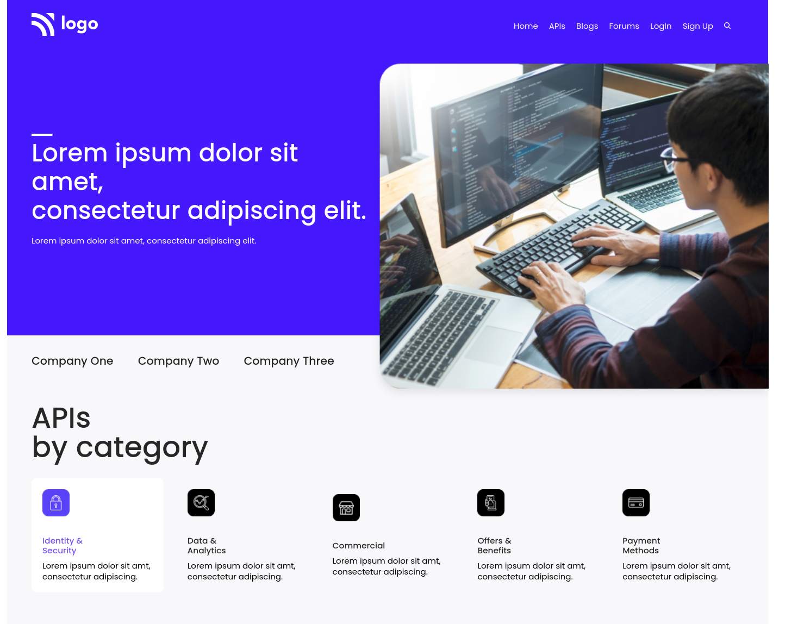
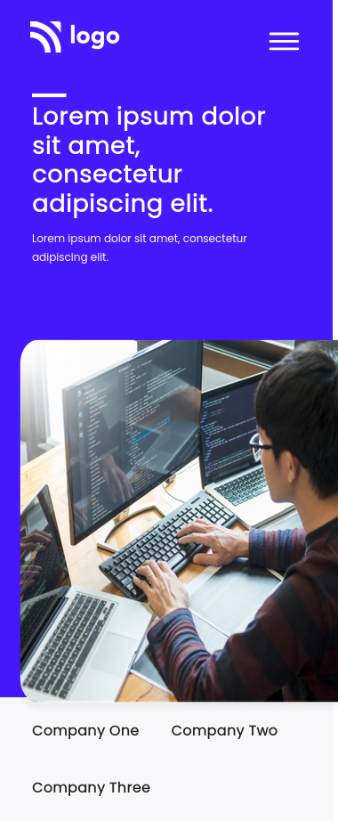

# PROJECT 9 - Developer Landing Page

This is the 9th Project-challenge among the 15 Ineuron-projects built with Semantic Html5 and css3.

## Table of contents

- [Overview](#overview)
  - [Screenshot](#screenshot)
  - [Links](#links)
- [My process](#my-process)
  - [Built with](#built-with)
  - [Time required](#time-required)
  - [What I learned](#continues-development)
  - [Useful resources](#useful-resources)
- [Author](#author)
- [Acknowledgments](#acknowledgments)

## Overview

### Screenshot





### Links

- Code File URL: [github.com](https://github.com/Jyotimoykathar/Project-9)
- Live Site URL: [netlify.app](https://project-9-developer-landing.netlify.app/)

## My process

### Built with

- Semantic HTML5 markup
- CSS custom properties
- Flexbox Css
- Grid Css

### Time required

Nearly 5 day required to completion with lot of errors and learning new things.

### What I learned

This is the css design code snippet of the footer section where i mostly learned of sudo clases and different ways of selecting child elements.

```css
.list .list-items {
  position: relative;
}
.list .list-items:not(:first-child):not(:last-child):after {
  position: absolute;
  content: "";
  height: 50%;
  width: 1px;
  top: 30%;
  right: -2.4rem;
  background-color: #fff;
}
```

### Continued development

I still have a lot to learn about flexbox and Grid items. Still lot to grasp on media queries and sudo class with element child selectors and combinators.

### Useful resources

- [MDN](https://developer.mozilla.org/en-US/) - This website helped me to any thing i had to look upon.
- [ION ICONS](https://ionic.io/ionicons) - Free icons available for your website, thats easy to implement.

## Author

- Github page- [Jyotimoykathar](https://github.com/Jyotimoykathar/)

## Acknowledgments

Special Thanks to Ineuron team for the responsive project-challenge to improve my media queries and child combinator skills.
